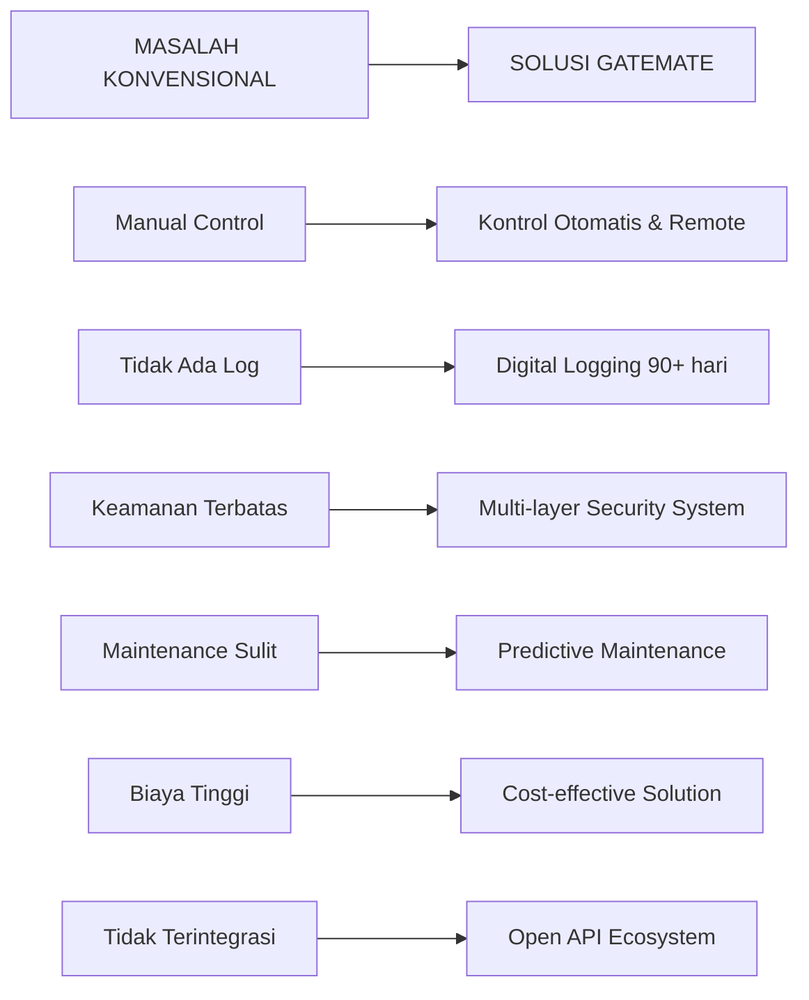
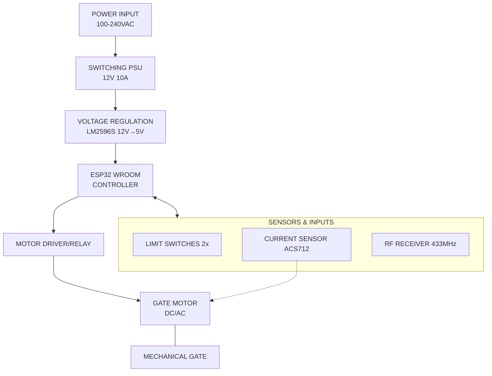

# **Proposal Inovasi Sistem Keamanan: Smart Automatic Gate System Berbasis IoT**

## **1. JUDUL & RINGKASAN EKSEKUTIF**

**JUDUL:** **GATEMATE SMART GATE SYSTEM**  
*Sistem Kontrol Gerbang Otomatis Pintar Berbasis IoT dengan Kontrol Web & Mobile App*

**RINGKASAN EKSEKUTIF:**

GATEMATE adalah solusi sistem kontrol gerbang otomatis terintegrasi berbasis IoT yang dirancang untuk meningkatkan **efisiensi operasional, keamanan perimeter, dan pengalaman pengguna** secara signifikan. Sistem ini menggantikan sistem gerbang manual atau semi-otomatis konvensional dengan solusi pintar yang dapat dikontrol melalui **Web Dashboard** dan **Mobile Application** secara real-time.

**NILAI UTAMA YANG DITAWARKAN:**
1. **KONTROL MULTI-AKSES**: Remote HP, Web Dashboard, Remote RF, dan Kontrol Lokal
2. **KEAMANAN MULTI-LAYER**: Sensor deteksi hambatan, monitoring arus, dan emergency stop
3. **INTEGRASI TERBUKA**: API untuk integrasi dengan sistem CCTV, Smart Home, dan sistem perusahaan
4. **MANAJEMEN TERPUSAT**: Multi-user management dengan permission levels yang jelas
5. **ANALYTICS & REPORTING**: Log aktivitas 90+ hari dan reporting real-time

**TARGET MANFAAT:**
- **Peningkatan Keamanan**: 99.9% availability dengan sistem monitoring 24/7
- **Efisiensi Waktu**: Reduksi 85% waktu operasional gerbang
- **Biaya Operasional**: Pengurangan 40% biaya maintenance dibanding sistem impor
- **Skalabilitas**: Dapat dikembangkan untuk single gate hingga enterprise multi-site

## **2. LATAR BELAKANG & MASALAH**

### **2.1 IDENTIFIKASI MASALAH SISTEM KONVENSIONAL**

| No | Masalah | Dampak | Frekuensi |
|----|---------|--------|-----------|
| 1 | **Keterlambatan Respons** | Antrean kendaraan, inefisiensi waktu | High (Daily) |
| 2 | **Ketergantungan pada Operator** | Biaya tenaga kerja tinggi, human error | High |
| 3 | **Tidak Ada Log Digital** | Sulit auditing, tidak ada accountability | Medium |
| 4 | **Keamanan Terbatas** | Rentan terhadap cloning RF, tidak ada deteksi intrusi | High |
| 5 | **Tidak Ada Monitoring Remote** | Sulit kontrol saat petugas tidak di lokasi | Medium |
| 6 | **Maintenance Reactive** | Kerusakan tidak terdeteksi dini | High |

### **2.2 SOLUSI GATEMATE**



## **3. SPESIFIKASI TEKNIS HARDWARE (STANDARD SEMUA UNIT)**

### **3.1 CORE HARDWARE SPECIFICATION**

**PRINSIP: "Satu Otak, Banyak Penerapan"** - Semua unit menggunakan controller dan sensor yang sama untuk konsistensi dan kemudahan maintenance.

#### **A. BRAIN UNIT - GATEMATE CONTROLLER**

| Komponen | Model | Spesifikasi | Fungsi Utama |
|----------|-------|-------------|--------------|
| **Mikrokontroler** | ESP32-WROOM-32E | Dual-core 240MHz, WiFi 4, BT 5, 4MB Flash | Otak sistem, komunikasi, processing |
| **Power Supply** | Custom Switching | Input: 100-240VAC, Output: 12VDC 10A | Catu daya stabil dengan proteksi OVP/OCP |
| **Power Regulator** | LM2596S + LDO | 12V→5V→3.3V, Efficiency >92% | Step-down untuk komponen digital |
| **Controller Board** | GATEMATE-001 | 2-layer PCB, IP66 rated enclosure | Integrasi semua komponen |

#### **B. SENSOR & ACTUATOR (STANDARD)**

| Sensor | Qty | Spesifikasi | Fungsi | Placement |
|--------|-----|-------------|--------|-----------|
| **Limit Switch** | 2x | Micro roller lever, IP67 | Deteksi posisi akhir (Open/Close) | Ujung rel gerbang |
| **Current Sensor** | 1x | ACS712-30A (±30A, 66mV/A) | Deteksi beban berlebih/motor stall | Serial dengan motor |
| **Temperature Sensor** | 1x | NTC Thermistor 10K | Monitoring suhu controller | Dalam enclosure |
| **Manual Control** | Remote RF 433MHz | 4-button, 100m range | Kontrol darurat tanpa internet | Optional add-on |

#### **C. MOTOR DRIVER & POWER MANAGEMENT**

| Driver | Tipe | Spesifikasi | Aplikasi |
|--------|------|-------------|----------|
| **Motor Driver** | L298N Dual H-Bridge | 2A per channel, PWM control | Motor DC hingga 500W |
| **Relay Module** | 2CH Optocoupler | 10A @ 250VAC, 5kV isolation | Motor AC single-phase |
| **Contactor** | 2-Pole 25A | Magnetic contactor with overload | Motor AC three-phase |

### **3.2 DIAGRAM BLOK HARDWARE**



## **4. FITUR PERANGKAT LUNAK UTAMA (INCLUDE/DEFAULT)**

### **4.1 SOFTWARE FEATURE MATRIX**

| Fitur | Mobile App | Web Dashboard | Deskripsi |
|-------|------------|---------------|-----------|
| **Real-time Control** | ✅ | ✅ | Buka/tutup/stop dengan latency <500ms |
| **Multi-language** | ✅ (5 langs) | ✅ (5 langs) | ID, EN, CN, AR, ES |
| **User Management** | ✅ (Add/Remove) | ✅ (Full control) | Admin, Operator, Viewer, Guest |
| **Activity Logs** | ✅ (Last 30 days) | ✅ (90+ days) | Filter by user, date, action |
| **Scheduled Operations** | ✅ (Basic) | ✅ (Advanced) | Daily, weekly, holiday schedules |
| **Guest Access** | ✅ (QR Code gen) | ✅ (Bulk manage) | Time-limited access with QR |
| **Notifications** | ✅ (Push) | ✅ (Email/SMS) | Real-time alerts for all events |
| **Device Health** | ✅ (Basic) | ✅ (Detailed) | Uptime, sensor status, warnings |
| **Reporting** | ⚠️ (Simple) | ✅ (Advanced) | PDF/Excel export, analytics |

### **4.2 USER PERMISSION LEVELS**

```yaml
User Roles:
  SUPER_ADMIN:
    - All permissions
    - User management
    - System configuration
    - Billing access
  
  ADMIN:
    - Device control
    - User management (except billing)
    - Schedule configuration
    - Log viewing
  
  OPERATOR:
    - Device control
    - Guest access management
    - Basic monitoring
  
  VIEWER:
    - Read-only access
    - Live status viewing
    - No control
  
  GUEST:
    - Time-limited access
    - Specific device only
    - QR code based
```

### **4.3 NOTIFICATION SYSTEM**

*   **Security Events**: Unauthorized access, Forced open, Safety triggered, Tamper detection.
*   **Operational Events**: Gate opened/closed, Scheduled op executed, Guest access used, Manual override.
*   **System Events**: Device offline, Low battery, Firmware update, Maintenance needed.

## **5. OPSI PENGEMBANGAN & INTEGRASI (ADD-ON FEATURES)**

### **5.1 ADD-ON FEATURES CATALOG**

| Kategori | Add-on Fitur | Deskripsi | Development Time | Biaya Tambahan |
|----------|--------------|-----------|------------------|----------------|
| **SURVEILLANCE** | CCTV Integration | ONVIF protocol, live view in app, motion detection triggers | 4-6 weeks | Rp 750.000 |
| | License Plate Recognition | Automatic opening for registered vehicles | 8-12 weeks | Rp 2.500.000 |
| **SMART HOME** | Apple HomeKit | Siri voice control, Home app integration | 3-4 weeks | Rp 500.000 |
| | Google Home/Alexa | Voice commands, routines | 2-3 weeks | Rp 400.000 |
| | SmartThings/Hubitat | Z-Wave/Zigbee integration | 4-6 weeks | Rp 600.000 |
| **ENTERPRISE** | API Integration | REST API for ERP/CRM integration | 2-4 weeks | Rp 1.000.000 |
| | SSO Authentication | LDAP/Active Directory integration | 3-5 weeks | Rp 800.000 |
| | Custom Reporting | Advanced analytics & BI integration | 4-8 weeks | Rp 1.200.000 |
| **SAFETY** | Advanced Sensors | LiDAR, thermal, pressure mat | 2-3 weeks | Rp 300.000-1.000.000 |
| | Emergency Power | UPS/battery backup system | 1 week | Rp 1.500.000+ |
| **AUTOMATION** | Geo-fencing | Auto-open when user approaches | 2-3 weeks | Rp 400.000 |
| | AI Pattern Learning | Predictive opening based on habits | 8-12 weeks | Rp 1.800.000 |

### **5.2 INTEGRATION ARCHITECTURE**

```mermaid
graph TD
    Core[GATEMATE CORE SYSTEM]
    App[Mobile App]
    Web[Web Dashboard]
    API[API Gateway]
    
    CCTV[CCTV SYSTEMS\n(ONVIF)]
    SmartHome[SMART HOME\n(MQTT/Webhooks)]
    Enterprise[ENTERPRISE SYSTEMS\n(ERP/CRM)]
    
    Core --- App
    Core --- Web
    Core --- API
    
    API --- CCTV
    API --- SmartHome
    API --- Enterprise
```

## **6. RENCANA ANGGARAN BIAYA (RAB)**

### **6.1 PAKET UTAMA - PER UNIT INSTALASI**

**Tabel 6.1: Harga Paket Dasar (Termasuk Instalasi)**

| Item | Deskripsi | Qty | Harga Satuan | Subtotal | Catatan |
|------|-----------|-----|--------------|----------|---------|
| **A. HARDWARE CONTROLLER** | | | | **Rp 1.250.000** | |
| 1 | GATEMATE Controller Unit | 1 | Rp 850.000 | Rp 850.000 | ESP32 + sensor + PCB |
| 2 | Power Supply 12V 10A | 1 | Rp 150.000 | Rp 150.000 | Switching dengan proteksi |
| 3 | Remote RF 433MHz | 1 | Rp 50.000 | Rp 50.000 | 4-button, 100m range |
| 4 | Installation Kit | 1 | Rp 200.000 | Rp 200.000 | Kabel, connector, mounting |
| **B. MOTOR & MEKANIKAL** | Pilih salah satu | | | **Varies** | |
| 5a | Motor Sliding Light (≤200kg) | 1 | Rp 1.200.000 | Rp 1.200.000 | DC 24V 150W |
| 5b | Motor Sliding Medium (≤500kg) | 1 | Rp 2.500.000 | Rp 2.500.000 | DC 24V 300W |
| 5c | Motor Sliding Heavy (≤1000kg) | 1 | Rp 4.500.000 | Rp 4.500.000 | DC 24V 500W |
| 5d | Motor Swing Gate | 1 | Rp 1.800.000 | Rp 1.800.000 | Linear actuator 1500N |
| **C. SOFTWARE & LISENSI** | | | | **Rp 1.000.000** | |
| 6 | Software License (3 tahun) | 1 | Rp 800.000 | Rp 800.000 | Update & support |
| 7 | User Accounts (5 users) | 1 | Rp 200.000 | Rp 200.000 | Additional: Rp 50.000/user |
| **D. INSTALASI** | | | | **Rp 1.500.000** | |
| 8 | Site Survey & Design | 1 | Rp 300.000 | Rp 300.000 | |
| 9 | Mechanical Installation | 1 | Rp 800.000 | Rp 800.000 | 2 teknisi × 2 hari |
| 10 | Configuration & Training | 1 | Rp 400.000 | Rp 400.000 | |
| **E. TOTAL PAKET** | | | | **Rp 3.750.000 - 7.250.000** | |

*Catatan: Harga belum termasuk PPN 11%*

### **6.2 TABEL ADD-ON FITUR**

**Tabel 6.2: Harga Fitur Tambahan**

| No | Add-on Fitur | Harga | Install Time | Maintenance |
|----|-------------|-------|--------------|-------------|
| 1 | CCTV Integration (ONVIF) | Rp 750.000 | 1 hari | Rp 100.000/tahun |
| 2 | Apple HomeKit Integration | Rp 500.000 | 2 jam | Included |
| 3 | Google Home/Alexa | Rp 400.000 | 2 jam | Included |
| 4 | Enterprise API Access | Rp 1.000.000 | 3-5 hari | Rp 200.000/tahun |
| 5 | Advanced Sensors Package | Rp 300.000-1.000.000 | 1-2 hari | Varies |
| 6 | UPS Backup System | Rp 1.500.000-3.000.000 | 1 hari | Rp 150.000/tahun |
| 7 | Custom Mobile App Branding | Rp 2.500.000 | 2-4 minggu | Rp 500.000/tahun |
| 8 | Multi-site Management | Rp 1.200.000 | 3 hari | Rp 300.000/tahun |

### **6.3 BIAYA BERLANGGANAN (OPTIONAL)**

| Paket | Biaya Tahunan | Fitur | Support |
|-------|---------------|-------|---------|
| **Basic** | Rp 500.000 | Software updates, Email support | 9am-5pm weekdays |
| **Professional** | Rp 1.200.000 | All Basic + Phone support, Priority updates | 8am-8pm, 7 days |
| **Enterprise** | Rp 2.500.000 | All Professional + SLA 99.9%, Dedicated engineer | 24/7 support |

## **7. IMPLEMENTASI & MAINTENANCE**

### **7.1 TIMELINE IMPLEMENTASI**

**IMPLEMENTATION TIMELINE (8-10 Business Days)**

*   **Day 1-2: SITE SURVEY & PREPARATION**
    *   Site visit & measurement
    *   Network assessment
    *   Electrical requirements check
    *   Design approval
*   **Day 3-5: HARDWARE INSTALLATION**
    *   Mechanical installation (motor, rail, wheels)
    *   Electrical wiring & safety checks
    *   Controller mounting & sensor placement
    *   Initial power-on test
*   **Day 6-7: SOFTWARE CONFIGURATION**
    *   Network setup (WiFi/Ethernet)
    *   Device registration & calibration
    *   User account creation
    *   Basic automation setup
*   **Day 8: TESTING & TRAINING**
    *   Full system testing (all features)
    *   User training (admin & operators)
    *   Documentation handover
    *   Go-live approval
*   **Day 9-10: POST-INSTALL SUPPORT**
    *   Monitoring first operations
    *   Fine-tuning adjustments
    *   Additional training if needed

### **7.2 MAINTENANCE & SUPPORT**

**A. GARANSI:**
- **Hardware Controller**: 2 tahun (kecuali kerusakan fisik)
- **Motor & Mekanikal**: 1 tahun (tergantung merk)
- **Software**: Update gratis 3 tahun pertama

**B. PREVENTIVE MAINTENANCE SCHEDULE:**
- **Monthly**: Software update check, Log review & cleanup, Remote diagnostics.
- **Quarterly**: Sensor calibration check, Mechanical inspection (lubrication, alignment), Battery check.
- **Annually**: Full system inspection, Electrical safety check, Performance optimization.

**C. SUPPORT CHANNELS:**
1. **Email Support**: support@gatemate.id (Response: <4 hours)
2. **Phone Support**: 1500-123 (Business hours)
3. **Remote Assistance**: TeamViewer/AnyDesk
4. **On-site Support**: Available within 48 hours (extra charge)

## **8. VARIASI PRODUK DENGAN STANDARD BASIC**

### **8.1 PRODUCT VARIAN MATRIX**

**Tabel 8.1: Variasi Produk Berdasarkan Tipe & Kapasitas**

| Model | Tipe | Kapasitas Max | Motor | Kecepatan | Aplikasi | Harga Paket |
|-------|------|---------------|-------|-----------|----------|-------------|
| **GATEMATE-LITE** | Sliding | 200 kg | DC 24V 150W | 20-30 detik | Residential, Small Office | Rp 3.750.000 |
| **GATEMATE-STD** | Sliding | 500 kg | DC 24V 300W | 15-25 detik | Medium Office, School | Rp 5.250.000 |
| **GATEMATE-PRO** | Sliding | 1000 kg | DC 24V 500W | 20-35 detik | Factory, Warehouse | Rp 7.250.000 |
| **GATEMATE-SWING** | Swing | 150 kg/daun | Linear Actuator | 25-40 detik | Villa, Limited Space | Rp 4.500.000 |
| **GATEMATE-BARRIER** | Barrier | 6m arm | DC 24V 100W | 3-6 detik | Parking, Toll Gate | Rp 4.000.000 |
| **GATEMATE-INDUSTRIAL** | Sliding | 2000 kg | AC 220V 750W | 30-60 detik | Heavy Industry | Rp 9.500.000 |

### **8.2 SPESIFIKASI STANDARD SEMUA VARIAN**

**COMMON SPECIFICATIONS (ALL MODELS):**

*   **CONTROLLER**: ESP32-WROOM-32E Dual Core, 4MB Flash, WiFi 4 + Bluetooth 5.
*   **SENSORS (STANDARD)**: 2× Limit Switch (Open/Close), 1× Current Sensor (ACS712-30A), 1× Temperature Sensor.
*   **COMMUNICATION**: WiFi 2.4GHz (802.11 b/g/n), MQTT Protocol (SSL/TLS), Remote RF 433MHz (backup).
*   **SOFTWARE FEATURES (ALL)**: Mobile App (iOS & Android), Web Dashboard, Multi-language Support, 90-day Activity Logs, User Management, Scheduled Operations, Guest Access, API Access.
*   **SAFETY FEATURES**: Auto-stop on obstacle detection, Emergency stop button, Overcurrent protection, Manual override capability.

### **8.3 RECOMMENDED APPLICATIONS**

*   **Residential Application (GATEMATE-LITE)**: Single-family homes, Max 200kg, DC 24V 150W.
*   **Commercial Application (GATEMATE-STD)**: Office buildings, schools, Max 500kg, DC 24V 300W.
*   **Industrial Application (GATEMATE-PRO)**: Factories, warehouses, Max 1000kg, DC 24V 500W.
*   **Special Application (GATEMATE-BARRIER)**: Parking systems, toll gates, Fast operation (3-6s).

---

## **KESIMPULAN**

GATEMATE Smart Gate System menawarkan solusi komprehensif untuk otomatisasi dan pengamanan gerbang dengan **standar kualitas tinggi, harga kompetitif, dan dukungan teknis lengkap**. Sistem ini dirancang untuk tumbuh bersama kebutuhan bisnis Anda, dari instalasi single gate hingga manajemen multi-site enterprise.

**KEY TAKEAWAYS:**
1. **STANDARDISASI**: Semua model menggunakan komponen inti yang sama untuk kemudahan maintenance
2. **FLEKSIBILITAS**: Dapat disesuaikan dengan berbagai tipe gerbang dan kapasitas
3. **INTEGRASI**: Open architecture memungkinkan integrasi dengan sistem existing
4. **SCALABILITY**: Dapat dikembangkan dari single unit hingga enterprise solution
5. **SUPPORT**: Tim teknis siap mendukung 24/7 dengan berbagai channel support

**NEXT STEPS:**
1. Site survey dan konsultasi gratis
2. Proposal detail sesuai kebutuhan spesifik
3. Pilot project (opsional)
4. Full implementation dengan garansi

---

**APPROVAL & SIGNATURE**

Disetujui oleh:

**Muhammad Fauzan**
Chief Technology Officer
PT. GATEMATE Teknologi Indonesia

Tanggal: 18 Januari 2026

**KONTAK IMPLEMENTASI:**
- Email: sales@gatemate.id
- Phone: +62 21 1500-123
- Website: www.gatemate.id
- Office: Jl. Teknologi No. 123, Jakarta

**DOKUMEN TERKAIT:**
1. Technical Specifications Sheet
2. Installation Guidelines
3. User Manual
4. API Documentation
5. Maintenance Agreement Template

*Proposal ini berlaku selama 30 hari dari tanggal penerbitan*
