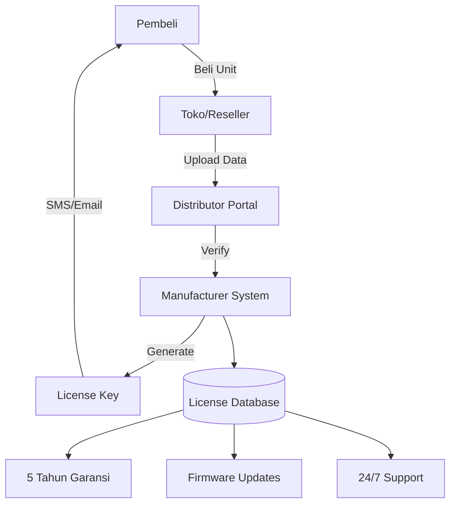
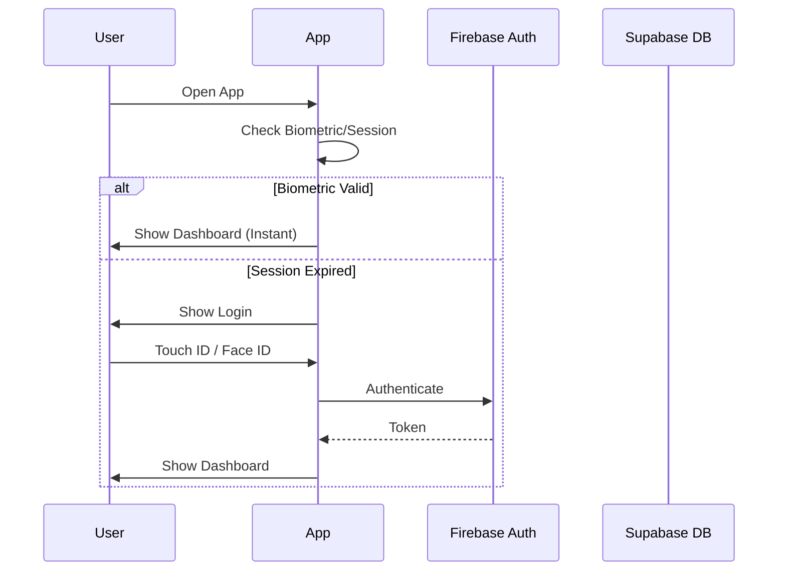

# SKEMA SISTEM KOMPREHENSIF
## GATEMATE Smart Gate Control System v2.0 (UX-Driven Architecture)

---

## 1. ARSITEKTUR SISTEM TERINTEGRASI

### 1.1 Philosophy & Prinsip Desain

```
┌─────────────────────────────────────────────────────────────────────────┐
│                        GATEMATE DESIGN PRINCIPLES                       │
├─────────────────────────────────────────────────────────────────────────┤
│  🔒 SECURITY FIRST    │ Multi-layer authentication, E2E encryption     │
│  🎯 USER EXPERIENCE   │ Zero-click automasi, minimal learning curve   │
│  📈 SCALABILITY       │ Single-home hingga multi-property management  │
│  ⚡ RELIABILITY       │ Offline-first, local fallback                 │
│  🔐 PRIVACY FIRST     │ Data lokal tetap lokal, user control penuh    │
└─────────────────────────────────────────────────────────────────────────┘
```

### 1.2 Architecture Layers (Optimized for UX)

```
┌─────────────────────────────────────────────────────────────────────────┐
│                              CLOUD LAYER                                │
│  ┌──────────┐  ┌──────────┐  ┌──────────┐  ┌──────────┐               │
│  │ Firebase │  │ Supabase │  │ Vercel   │  │ MQTT     │               │
│  │ Auth     │  │ Database │  │ Edge     │  │ Broker   │               │
│  └────┬─────┘  └────┬─────┘  └────┬─────┘  └────┬─────┘               │
└───────┼─────────────┼─────────────┼─────────────┼───────────────────────┘
        │ HTTPS       │ API         │ CDN         │ MQTT/TLS
┌───────▼─────────────▼─────────────▼─────────────▼───────────────────────┐
│                         APPLICATION LAYER                               │
│  ┌──────────────────┐  ┌──────────────────┐  ┌──────────────────┐      │
│  │   PWA Frontend   │  │  Mobile App      │  │  Admin Portal    │      │
│  │ (Offline Ready)  │  │  (Native UX)     │  │  (Analytics)     │      │
│  └────────┬─────────┘  └────────┬─────────┘  └────────┬─────────┘      │
└───────────┼──────────────────────┼──────────────────────┼───────────────┘
            │ WebSocket            │ REST API             │ GraphQL
┌───────────▼──────────────────────▼──────────────────────▼───────────────┐
│                         BACKEND LAYER                                   │
│  ┌──────────┐  ┌──────────┐  ┌──────────┐  ┌──────────┐               │
│  │ NestJS   │  │ MQTT     │  │ Redis    │  │ TimescaleDB│              │
│  │ API      │  │ Bridge   │  │ Cache    │  │ Analytics│               │
│  └────┬─────┘  └────┬─────┘  └────┬─────┘  └────┬─────┘               │
└───────┼─────────────┼─────────────┼─────────────┼───────────────────────┘
        │ MQTT        │ RS485       │ GPIO        │ SPI
┌───────▼─────────────▼─────────────▼─────────────▼───────────────────────┐
│                         DEVICE LAYER                                    │
│  ┌──────────────┐  ┌──────────────┐  ┌────────────────────────┐        │
│  │ ESP32 Main   │  │ Raspberry Pi │  │ Sensor Array           │        │
│  │ Controller   │  │ Local Hub    │  │ (IR, Current, Encoder) │        │
│  └──────────────┘  └──────────────┘  └────────────────────────┘        │
└─────────────────────────────────────────────────────────────────────────┘
```

---

## 2. ALUR PRODUK: PEMBELIAN → OPERATIONAL

### 2.1 Fase Registrasi Produk



### 2.2 First-Time Setup Flow (Zero-Friction UX)

```
┌─────────────────────────────────────────────────────────────────────────┐
│                         FIRST-TIME SETUP WIZARD                         │
├─────────────────────────────────────────────────────────────────────────┤
│                                                                         │
│  Step 1: Splash Screen                                                  │
│  ┌───────────────────┐                                                  │
│  │     GATEMATE      │  • Logo animation (Lottie)                       │
│  │    v2.0 Loading   │  • Version check                                 │
│  └───────────────────┘  • Connectivity test                             │
│            ▼                                                            │
│  Step 2: License Verification                                           │
│  ┌───────────────────┐                                                  │
│  │ Enter License Key │  • Auto-paste support                            │
│  │ [GMT-XXXX-YYYY]   │  • QR Code scan (Camera API)                     │
│  │                   │  • Haptic feedback on success                    │
│  └───────────────────┘                                                  │
│            ▼                                                            │
│  Step 3: Hardware Setup                                                 │
│  ┌───────────────────┐                                                  │
│  │ Connect to Device │  • Bluetooth LE Discovery                        │
│  │ Calibrate Motor   │  • Real-time progress bar                        │
│  │ Test Sensors      │  • Visual step-by-step guide                     │
│  └───────────────────┘                                                  │
│            ▼                                                            │
│  Step 4: Success Screen                                                 │
│  ┌───────────────────┐                                                  │
│  │ ✅ Setup Complete │  • Confetti animation                            │
│  │   Start Using     │  • "Add to Home Screen" prompt                   │
│  │   GATEMATE        │  • Single tap to Dashboard                       │
│  └───────────────────┘                                                  │
│                                                                         │
└─────────────────────────────────────────────────────────────────────────┘
```

---

## 3. DAILY OPERATION FLOWS

### 3.1 Authentication Flow



### 3.2 Gate Control Flow (Optimistic UX)

```
User Action ("Open") 
    │
    ├─► UI Immediate Update (State: "Opening...") [Optimistic]
    ├─► Haptic Feedback (Vibrate 50ms)
    │
    ▼
Network Request (MQTT)
    │
    ├─► Success: Keep "Opening" State -> "Open"
    │
    └─► Fail: Revert State + Show Toast ("Connection failed")
```

---

## 4. DATABASE SCHEMA (Supabase)

### 4.1 Core Tables with Performance Indexing

```sql
-- Users (extends Firebase Auth)
CREATE TABLE public.users (
    id UUID PRIMARY KEY REFERENCES auth.users(id),
    full_name TEXT NOT NULL,
    preferences JSONB DEFAULT '{"theme": "system", "haptics": true}',
    created_at TIMESTAMPTZ DEFAULT NOW()
);

-- Devices
CREATE TABLE public.devices (
    id UUID PRIMARY KEY DEFAULT gen_random_uuid(),
    license_key TEXT UNIQUE NOT NULL,
    name TEXT NOT NULL,
    status JSONB, -- Caching status for fast read
    updated_at TIMESTAMPTZ,
    created_at TIMESTAMPTZ DEFAULT NOW()
);

-- Guest Access (High Security)
CREATE TABLE public.guest_access (
    id UUID PRIMARY KEY DEFAULT gen_random_uuid(),
    device_id UUID REFERENCES devices(id),
    guest_name TEXT,
    qr_code_hash TEXT UNIQUE,
    valid_until TIMESTAMPTZ NOT NULL,
    created_at TIMESTAMPTZ DEFAULT NOW()
);

-- Indexes for Speed
CREATE INDEX idx_devices_user ON device_users(user_id);
CREATE INDEX idx_logs_device ON activity_logs(device_id, created_at DESC);
```

---

## 5. API ENDPOINTS (UX Optimized)

### 5.1 REST API (Cache-Control Enabled)

| Method | Endpoint | UX Purpose | Caching Strategy |
|--------|----------|------------|------------------|
| GET | `/api/devices` | Dashboard Load | `stale-while-revalidate` |
| POST | `/api/control` | Gate Action | No-Cache, Optimistic |
| GET | `/api/logs` | History View | `max-age=60` |

---

## 6. OFFLINE CAPABILITY & PWA

### 6.1 Service Worker Strategy

```javascript
// Reliable First
const STRATEGIES = {
    'api/control': 'network-only', // Command must go through
    'api/status': 'network-first', // Try fresh, fall back to cache
    'assets': 'cache-first'        // Instant load
};

// Background Sync
if ('serviceWorker' in navigator && 'SyncManager' in window) {
    navigator.serviceWorker.ready.then(sw => {
        return sw.sync.register('sync-commands');
    });
}
```

---

## 7. UX-DRIVEN ARCHITECTURE MAPPING

Bagian ini memetakan **9 Kriteria Perfect UI/UX** ke modul teknis spesifik:

### 1. Adaptif & Kompatibel
- **Tech:** React Responsive + Tailwind Grid System.
- **Architect:** Layout engine terpisah untuk Mobile (Card View) & Desktop (Table View).

### 2. UI Elements Intuitif
- **Tech:** `framer-motion` untuk micro-interactions (layout transitions).
- **Architect:** Global State Store (Zustand) untuk sinkronisasi status UI instan.

### 3. Performa Cepat
- **Tech:** Vite Code Splitting, WebP Assets, Edge Caching (Vercel).
- **Architect:** Optimistic UI updates (update tampilan sebelum konfirmasi server).

### 4. Konten Jelas
- **Tech:** Google Fonts Preconnect (Inter), Dynamic Localization support.
- **Architect:** CMS-less hardcoded microcopy untuk kecepatan render.

### 5. Aksesibilitas
- **Tech:** `@radix-ui/react-accessible-icon`, Semantic HTML5.
- **Architect:** Color contrast monitoring di CI/CD pipeline.

### 6. Personalisasi
- **Tech:** `localStorage` persistence untuk user preferences (Dark mode, Sound).
- **Architect:** User Profile Service di Supabase.

### 7. Keamanan & Kepercayaan
- **Tech:** WebAuthn (Biometric), JWT Rotation.
- **Architect:** RLS (Row Level Security) di level database, bukan hanya aplikasi.

### 8. Pengujian & Iterasi
- **Tech:** MS Clarity recording, Sentry Error Tracking.
- **Architect:** Feature Flags (Remote Config) untuk A/B testing live.

### 9. Integrasi Teknologi Terkini
- **Tech:** Web Speech API (Voice Control), Vibration API (Haptics).
- **Architect:** Modular AI service (bisa plug-and-play model prediksi masa depan).

---

## 8. DEPLOYMENT & ROADMAP

```
┌─────────────────────────────────────────────────────────────────────────┐
│                         PRODUCTION DEPLOYMENT                           │
├─────────────────────────────────────────────────────────────────────────┤
│                                                                         │
│  ┌─────────────┐    ┌─────────────┐    ┌─────────────┐                │
│  │   Vercel    │    │  Supabase   │    │  Firebase   │                │
│  │   (PWA)     │    │   (Data)    │    │   (Auth)    │                │
│  └──────┬──────┘    └──────┬──────┘    └──────┬──────┘                │
│         │                  │                  │                        │
│         └──────────────────┼──────────────────┘                        │
│                            │                                           │
│                    ┌───────▼───────┐                                   │
│                    │  ESP32 Fleet  │                                   │
│                    │  (MQTT/TLS)   │                                   │
│                    └────────────────┘                                  │
└─────────────────────────────────────────────────────────────────────────┘
```
