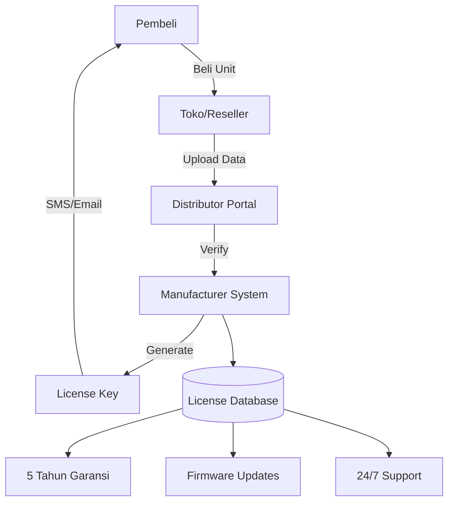
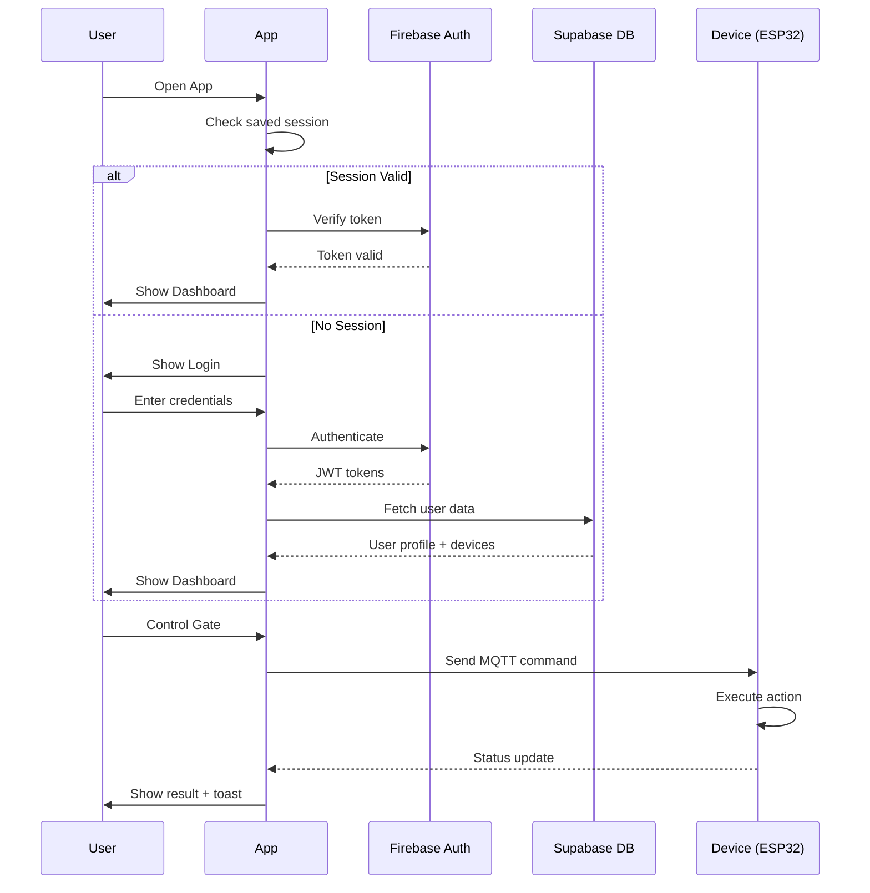

# SKEMA SISTEM KOMPREHENSIF
## GATEMATE Smart Gate Control System v2.0

---

## 1. ARSITEKTUR SISTEM TERINTEGRASI

### 1.1 Philosophy & Prinsip Desain

```
┌─────────────────────────────────────────────────────────────────────────┐
│                        GATEMATE DESIGN PRINCIPLES                       │
├─────────────────────────────────────────────────────────────────────────┤
│  🔒 SECURITY FIRST    │ Multi-layer authentication, E2E encryption     │
│  🎯 USER EXPERIENCE   │ Zero-click automasi, minimal learning curve   │
│  📈 SCALABILITY       │ Single-home hingga multi-property management  │
│  ⚡ RELIABILITY       │ Offline-first, local fallback                 │
│  🔐 PRIVACY FIRST     │ Data lokal tetap lokal, user control penuh    │
└─────────────────────────────────────────────────────────────────────────┘
```

### 1.2 Architecture Layers

```
┌─────────────────────────────────────────────────────────────────────────┐
│                              CLOUD LAYER                                │
│  ┌──────────┐  ┌──────────┐  ┌──────────┐  ┌──────────┐               │
│  │ Firebase │  │ Supabase │  │ Vercel   │  │ MQTT     │               │
│  │ Auth     │  │ Database │  │ Hosting  │  │ Broker   │               │
│  └────┬─────┘  └────┬─────┘  └────┬─────┘  └────┬─────┘               │
└───────┼─────────────┼─────────────┼─────────────┼───────────────────────┘
        │ HTTPS       │ API         │ CDN         │ MQTT/TLS
┌───────▼─────────────▼─────────────▼─────────────▼───────────────────────┐
│                         APPLICATION LAYER                               │
│  ┌──────────────────┐  ┌──────────────────┐  ┌──────────────────┐      │
│  │   PWA Frontend   │  │  Mobile App      │  │  Admin Portal    │      │
│  │   (React/Vite)   │  │  (React Native)  │  │  (Next.js)       │      │
│  └────────┬─────────┘  └────────┬─────────┘  └────────┬─────────┘      │
└───────────┼──────────────────────┼──────────────────────┼───────────────┘
            │ WebSocket            │ REST API             │ GraphQL
┌───────────▼──────────────────────▼──────────────────────▼───────────────┐
│                         BACKEND LAYER                                   │
│  ┌──────────┐  ┌──────────┐  ┌──────────┐  ┌──────────┐               │
│  │ NestJS   │  │ MQTT     │  │ Redis    │  │ TimescaleDB│              │
│  │ API      │  │ Bridge   │  │ Cache    │  │ Analytics│               │
│  └────┬─────┘  └────┬─────┘  └────┬─────┘  └────┬─────┘               │
└───────┼─────────────┼─────────────┼─────────────┼───────────────────────┘
        │ MQTT        │ RS485       │ GPIO        │ SPI
┌───────▼─────────────▼─────────────▼─────────────▼───────────────────────┐
│                         DEVICE LAYER                                    │
│  ┌──────────────┐  ┌──────────────┐  ┌────────────────────────┐        │
│  │ ESP32 Main   │  │ Raspberry Pi │  │ Sensor Array           │        │
│  │ Controller   │  │ Local Hub    │  │ (IR, Current, Encoder) │        │
│  └──────────────┘  └──────────────┘  └────────────────────────┘        │
└─────────────────────────────────────────────────────────────────────────┘
```

---

## 2. ALUR PRODUK: PEMBELIAN → OPERATIONAL

### 2.1 Fase Registrasi Produk



### 2.2 First-Time Setup Flow

```
┌─────────────────────────────────────────────────────────────────────────┐
│                         FIRST-TIME SETUP WIZARD                         │
├─────────────────────────────────────────────────────────────────────────┤
│                                                                         │
│  Step 1: Splash Screen                                                  │
│  ┌───────────────────┐                                                  │
│  │     GATEMATE      │  • Logo animation                                │
│  │    v2.0 Loading   │  • Version check                                 │
│  └───────────────────┘  • Connectivity test                             │
│            ▼                                                            │
│  Step 2: License Verification                                           │
│  ┌───────────────────┐                                                  │
│  │ Enter License Key │  • Manual input                                  │
│  │ [GMT-XXXX-YYYY]   │  • QR Code scan                                  │
│  │                   │  • Online verification                           │
│  └───────────────────┘                                                  │
│            ▼                                                            │
│  Step 3: Admin Account                                                  │
│  ┌───────────────────┐                                                  │
│  │ Create Admin      │  • Email/Password                                │
│  │ Setup 2FA         │  • Recovery key backup                           │
│  │ Generate Keys     │  • Biometric enrollment                          │
│  └───────────────────┘                                                  │
│            ▼                                                            │
│  Step 4: Hardware Setup                                                 │
│  ┌───────────────────┐                                                  │
│  │ Connect to Device │  • WiFi pairing                                  │
│  │ Calibrate Motor   │  • Limit switch setup                            │
│  │ Test Sensors      │  • Safety calibration                            │
│  └───────────────────┘                                                  │
│            ▼                                                            │
│  Step 5: Success Screen                                                 │
│  ┌───────────────────┐                                                  │
│  │ ✅ Setup Complete │  • Video tutorial                                │
│  │   Start Using     │  • Download manual                               │
│  │   GATEMATE        │  • Contact support                               │
│  └───────────────────┘                                                  │
│                                                                         │
└─────────────────────────────────────────────────────────────────────────┘
```

---

## 3. DAILY OPERATION FLOWS

### 3.1 Authentication Flow



### 3.2 Gate Control Flow

```
User Action → App Validation → MQTT Publish → ESP32 Receive →
→ Safety Check → Motor Control → Position Update → App Update → Toast Notify
```

**State Machine:**
```
┌──────────┐    open()    ┌──────────┐    reached()  ┌──────────┐
│  CLOSED  │─────────────►│ OPENING  │──────────────►│   OPEN   │
└──────────┘              └──────────┘               └──────────┘
     ▲                         │                          │
     │                    stop()│                         │
     │                         ▼                          │
     │                    ┌──────────┐                    │
     │                    │ STOPPED  │                    │
     │                    └──────────┘                    │
     │                         │                          │
     │◄────────────────────────┘                          │
     │                    close()                         │
     │                                                    │
     │                    ┌──────────┐                    │
     └────────────────────│ CLOSING  │◄───────────────────┘
       reached()          └──────────┘     close()
```

---

## 4. DATABASE SCHEMA (Supabase)

### 4.1 Core Tables

```sql
-- Users (extends Firebase Auth)
CREATE TABLE public.users (
    id UUID PRIMARY KEY REFERENCES auth.users(id),
    full_name TEXT NOT NULL,
    phone TEXT,
    role TEXT DEFAULT 'member',
    created_at TIMESTAMPTZ DEFAULT NOW()
);

-- Devices
CREATE TABLE public.devices (
    id UUID PRIMARY KEY DEFAULT gen_random_uuid(),
    license_key TEXT UNIQUE NOT NULL,
    name TEXT NOT NULL,
    type TEXT CHECK (type IN ('sliding', 'swing', 'barrier')),
    mac_address TEXT UNIQUE,
    firmware_version TEXT,
    is_online BOOLEAN DEFAULT false,
    last_seen TIMESTAMPTZ,
    created_at TIMESTAMPTZ DEFAULT NOW()
);

-- Device Users (M:N relationship)
CREATE TABLE public.device_users (
    device_id UUID REFERENCES devices(id) ON DELETE CASCADE,
    user_id UUID REFERENCES users(id) ON DELETE CASCADE,
    role TEXT DEFAULT 'member',
    permissions JSONB DEFAULT '[]',
    PRIMARY KEY (device_id, user_id)
);

-- Activity Logs
CREATE TABLE public.activity_logs (
    id BIGSERIAL PRIMARY KEY,
    device_id UUID REFERENCES devices(id),
    user_id UUID REFERENCES users(id),
    action TEXT NOT NULL,
    details JSONB,
    created_at TIMESTAMPTZ DEFAULT NOW()
);

-- Schedules
CREATE TABLE public.schedules (
    id UUID PRIMARY KEY DEFAULT gen_random_uuid(),
    device_id UUID REFERENCES devices(id),
    action TEXT CHECK (action IN ('open', 'close', 'partial')),
    cron_expression TEXT,
    is_enabled BOOLEAN DEFAULT true,
    created_by UUID REFERENCES users(id),
    created_at TIMESTAMPTZ DEFAULT NOW()
);

-- Guest Access
CREATE TABLE public.guest_access (
    id UUID PRIMARY KEY DEFAULT gen_random_uuid(),
    device_id UUID REFERENCES devices(id),
    guest_name TEXT,
    qr_code_hash TEXT UNIQUE,
    permissions TEXT[] DEFAULT ARRAY['open'],
    valid_from TIMESTAMPTZ DEFAULT NOW(),
    valid_until TIMESTAMPTZ NOT NULL,
    max_uses INT DEFAULT 1,
    used_count INT DEFAULT 0,
    created_by UUID REFERENCES users(id),
    created_at TIMESTAMPTZ DEFAULT NOW()
);

-- Enable RLS
ALTER TABLE users ENABLE ROW LEVEL SECURITY;
ALTER TABLE devices ENABLE ROW LEVEL SECURITY;
ALTER TABLE device_users ENABLE ROW LEVEL SECURITY;
ALTER TABLE activity_logs ENABLE ROW LEVEL SECURITY;
ALTER TABLE schedules ENABLE ROW LEVEL SECURITY;
ALTER TABLE guest_access ENABLE ROW LEVEL SECURITY;
```

### 4.2 RLS Policies

```sql
-- Users can only see their own data
CREATE POLICY "Users view own data" ON users
    FOR SELECT USING (auth.uid() = id);

-- Users can see devices they have access to
CREATE POLICY "Users view accessible devices" ON devices
    FOR SELECT USING (
        id IN (
            SELECT device_id FROM device_users 
            WHERE user_id = auth.uid()
        )
    );

-- Device access control
CREATE POLICY "Device users access" ON device_users
    FOR SELECT USING (user_id = auth.uid());
```

---

## 5. API ENDPOINTS

### 5.1 REST API

| Method | Endpoint | Description |
|--------|----------|-------------|
| GET | `/api/devices` | List user's devices |
| GET | `/api/devices/:id` | Get device details |
| POST | `/api/devices/:id/control` | Control gate |
| GET | `/api/devices/:id/logs` | Get activity logs |
| GET | `/api/schedules` | List schedules |
| POST | `/api/schedules` | Create schedule |
| PUT | `/api/schedules/:id` | Update schedule |
| DELETE | `/api/schedules/:id` | Delete schedule |
| POST | `/api/guest-access` | Create guest access |
| GET | `/api/guest-access` | List guest access |

### 5.2 MQTT Topics

| Topic | Direction | Payload |
|-------|-----------|---------|
| `gatemate/{device_id}/command` | App → Device | `{"action": "open", "user_id": "..."}` |
| `gatemate/{device_id}/status` | Device → App | `{"state": "open", "percentage": 100}` |
| `gatemate/{device_id}/sensors` | Device → App | `{"current": 2.5, "temp": 32}` |
| `gatemate/{device_id}/alert` | Device → App | `{"type": "obstruction", "severity": "warning"}` |

---

## 6. SECURITY IMPLEMENTATION

### 6.1 Authentication Layers

```
Layer 1: Firebase Authentication
├── Email/Password
├── Google OAuth
├── Apple Sign-In
└── Phone (SMS OTP)

Layer 2: App-level Security
├── Biometric (Face ID/Fingerprint)
├── PIN Code
└── Session Management

Layer 3: Device Security
├── MQTT TLS Encryption
├── Device Certificate
└── Command Signing
```

### 6.2 Encryption Standards

| Data Type | Encryption | Key Management |
|-----------|------------|----------------|
| Auth Tokens | JWT/RS256 | Firebase |
| API Calls | HTTPS TLS 1.3 | Auto-managed |
| MQTT Messages | TLS + AES-256 | Device cert |
| Stored Data | AES-256-GCM | Supabase Vault |

---

## 7. OFFLINE CAPABILITY

### 7.1 PWA Service Worker

```javascript
// Caching Strategy
const CACHE_STRATEGIES = {
    'api/devices': 'stale-while-revalidate',
    'api/schedules': 'cache-first',
    'assets/*': 'cache-first',
    'fonts/*': 'cache-first'
};

// Offline Queue
const offlineQueue = {
    commands: [],
    
    add(command) {
        this.commands.push({
            ...command,
            timestamp: Date.now(),
            synced: false
        });
    },
    
    async sync() {
        const unsynced = this.commands.filter(c => !c.synced);
        for (const cmd of unsynced) {
            await sendCommand(cmd);
            cmd.synced = true;
        }
    }
};
```

### 7.2 Local Control Fallback

```
┌─────────────────────────────────────────┐
│           OFFLINE MODE                  │
├─────────────────────────────────────────┤
│  1. Bluetooth LE Direct Control         │
│     └─ Range: ~30 meters                │
│                                         │
│  2. Local WiFi (without internet)       │
│     └─ ESP32 acts as AP                 │
│                                         │
│  3. Physical Button Fallback            │
│     └─ Always available                 │
└─────────────────────────────────────────┘
```

---

## 8. MONITORING & MAINTENANCE

### 8.1 Health Metrics

| Metric | Normal Range | Alert Threshold |
|--------|--------------|-----------------|
| Motor Current | 1-5A | >8A |
| Temperature | 20-45°C | >60°C |
| WiFi Signal | -40 to -70 dBm | < -80 dBm |
| Response Time | <500ms | >2000ms |
| Battery Level | 50-100% | <20% |

### 8.2 Predictive Maintenance

```javascript
const maintenancePredictor = {
    checkMotorHealth(runtime, cycles) {
        if (runtime > 2000) return { urgency: 'high', message: 'Motor service due' };
        if (cycles > 50000) return { urgency: 'medium', message: 'Check bearings' };
        return { urgency: 'low', message: 'Normal operation' };
    },
    
    checkSensorHealth(readings) {
        const variance = calculateVariance(readings);
        if (variance > THRESHOLD) {
            return { urgency: 'medium', message: 'Sensor calibration needed' };
        }
        return { urgency: 'low', message: 'Sensors OK' };
    }
};
```

---

## 9. DEPLOYMENT ARCHITECTURE

```
┌─────────────────────────────────────────────────────────────────────────┐
│                         PRODUCTION DEPLOYMENT                           │
├─────────────────────────────────────────────────────────────────────────┤
│                                                                         │
│  ┌─────────────┐    ┌─────────────┐    ┌─────────────┐                │
│  │   Vercel    │    │  Supabase   │    │  Firebase   │                │
│  │   (PWA)     │    │  (Database  │    │  (Auth)     │                │
│  │             │    │   + Edge)   │    │             │                │
│  └──────┬──────┘    └──────┬──────┘    └──────┬──────┘                │
│         │                  │                  │                        │
│         └──────────────────┼──────────────────┘                        │
│                            │                                           │
│                    ┌───────▼───────┐                                   │
│                    │   HiveMQ      │                                   │
│                    │ (MQTT Cloud)  │                                   │
│                    └───────┬───────┘                                   │
│                            │                                           │
│                    ┌───────▼───────┐                                   │
│                    │  ESP32 Devices │                                  │
│                    │  (Field)       │                                  │
│                    └────────────────┘                                  │
│                                                                         │
└─────────────────────────────────────────────────────────────────────────┘
```

---

## 10. ROADMAP

| Phase | Timeline | Features |
|-------|----------|----------|
| **v1.0** | Current | Basic control, PWA, Firebase Auth |
| **v2.0** | Q2 2026 | Supabase integration, Guest access, Schedules |
| **v3.0** | Q3 2026 | Multi-property, Analytics dashboard |
| **v4.0** | Q4 2026 | AI anomaly detection, Voice control |
| **v5.0** | Q1 2027 | Smart city integration, Fleet management |
